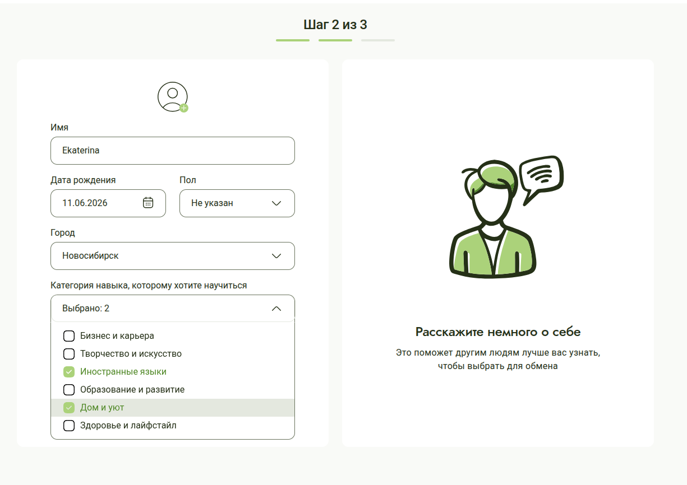
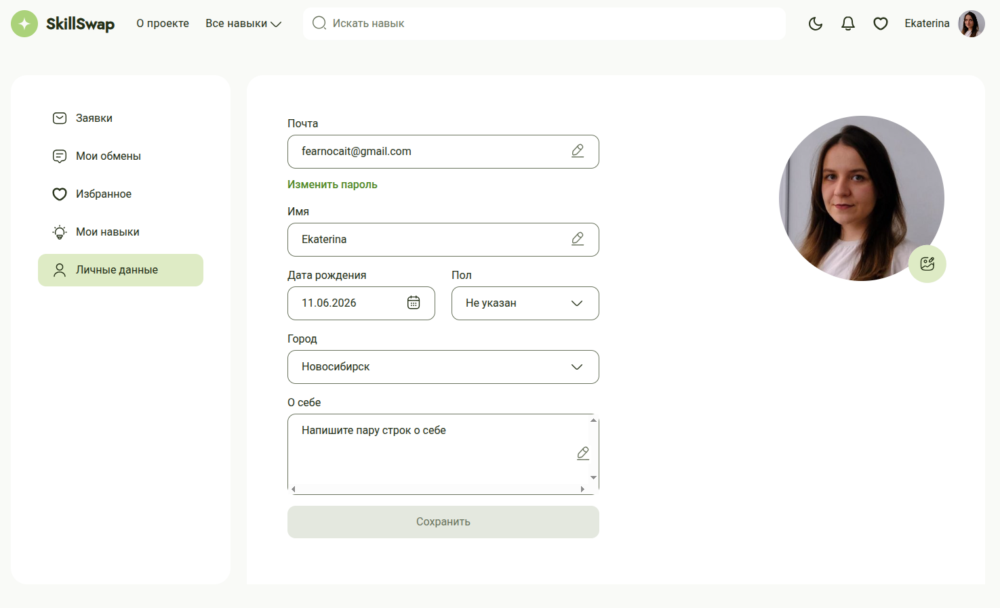
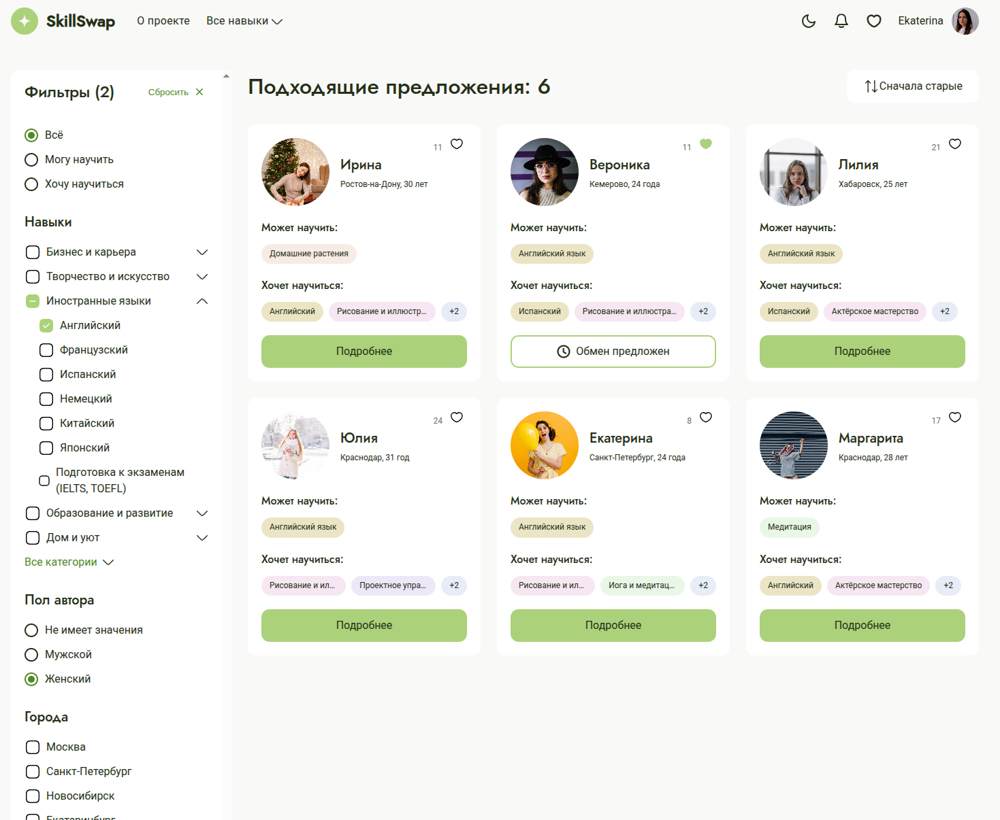
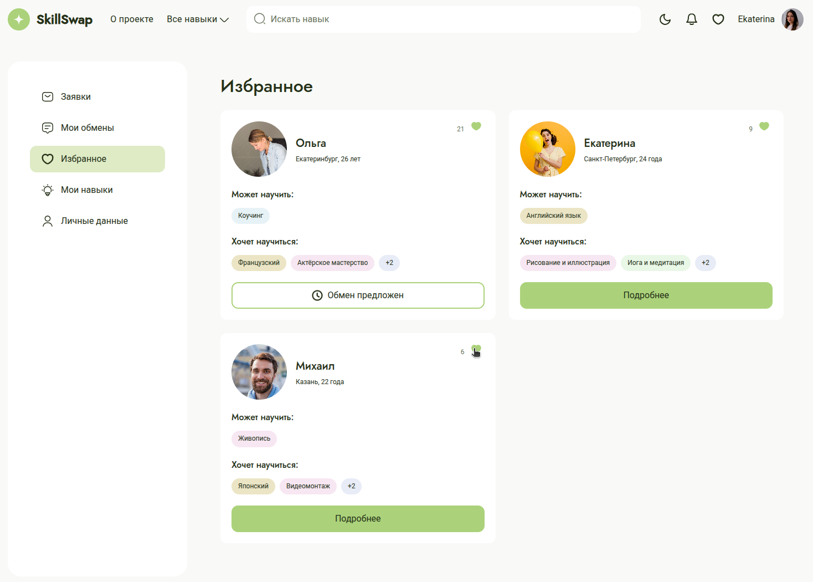

# SkillSwap – Your Platform for Swapping Skills

Frontend for SkillSwap, a social network that enables users to learn new skills and share their expertise with others. The backend is available [here](https://github.com/albrekhtdurer/skillswap_back).

## Main details

The project implements the FSD architecture.

Tech stack: TypeScript, React, React Router, Redux Toolkit, Vite, CSS.

## Features

- Users can register, log in, and update their personal information.


- Users can load skill offerings on the main page and filter them by category or teacher information (city, gender). Search by skill or category name is also available.

- Users can add a skill card to their favorites and view their favorite cards in their personal account.


## Project information and my role

The project was developed from scratch based on a pre-designed Figma layout by a team of 10 frontend developers as a Graduation Project for the Yandex Practicum Fullstack Developer course.

In the team, I acted as team lead. My responsibilities included:

- System analysis: analyzing the layout, preparing questions for the mentor, and defining tasks for teammates.
- Backlog management: prioritizing and organizing tasks, refining task descriptions, and coordinating upcoming work.
- Environment setup: initial repository structure, CI/CD checks, and npm scripts for pre-commit checks.
- Code review and bug fixes.
- Development: implemented the favorites widget on the user page and enabled the likes logic so that skill cards liked by the user are added and displayed in the favorites section.

I also developed the FastAPI backend for this project on my own. The backend can be found [here](https://github.com/albrekhtdurer/skillswap_back).

## How to launch

1. Install dependencies:

```bash
npm install
```

2. Install and launch [the backend](https://github.com/albrekhtdurer/skillswap_back)

3. Launch the application:

```bash
npm run dev
```

4. The app will be available at `http://localhost:5173/`.
